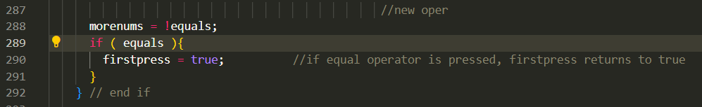
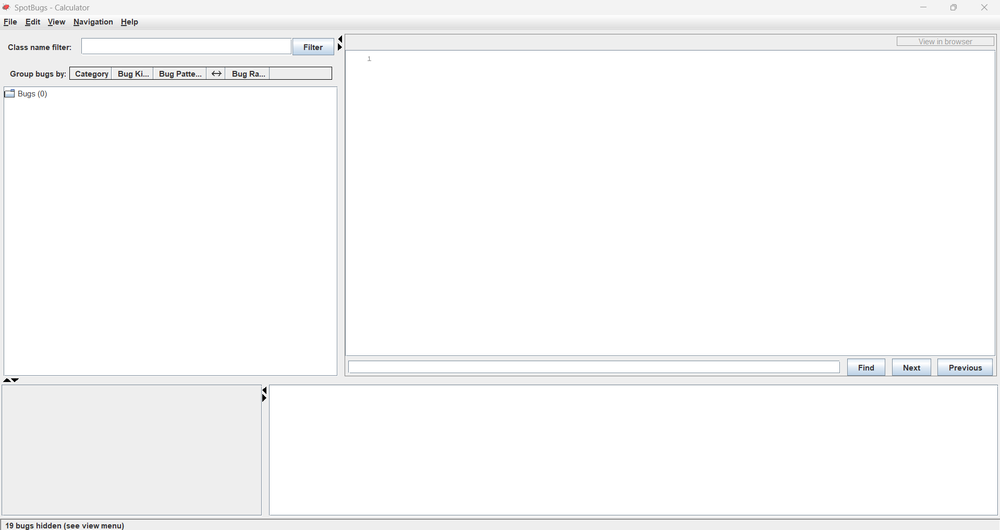

Here is a screenshot of Spot Bugs running for the first time on calculator app

Here are all the bugs discovered by the program

Here is the calculator app running

For the first bug we have Comparison of String parameter using == or !=. This means that we are using == operators which could cause issues. To fix this bug I would use s.equals("") instead. I modified the code using the equals method.

For the second bug we have certain swing methods need to be invoked in swing thread. That means that certain swing methods like setVisible() should be called on the event dispatcher thread (EDT) to avoid threading issues. To fix this bug I would use swingUtilities.invokeLater so that setVisible(true) is called on the EDT. I modified the code using what I described.

For the 3rd bug we have could be refactored into named static class. I have created a new private static class that takes care of this issue

4th bug is setClearscreen() is never called in CalCFrameTest.java. This is because we are never using setClearscreen() in the main code because it is part of the test code. I would either modify it so that it serves a purpose or get rid of it.

5th bug is Boxing/unboxing to parse a primitive. This means that we are creating a double from a string just to get the primitive double value. I would fix this bug by using Double.parseDouble. I modified the code using Double.parseDouble.

6th, 7th and 8th Bugs is exactly the same as bug number 5. So I did pretty much the same thing using Double.parseDouble.

For the 9 through 14 bugs we have the same error: `Unread field: should this field be static?` This is because their values are known at compile time and their values never change (they are constant). To fix this I would use `private static final int` to reflect that they are class-level constants rather than instance level. I modified the code using what I suggested.

For the 15th bug we have `Switch statement found where default case is missing`. This is because we are missing a default case for the switch statement. I would fix that by adding a default case and making it throw an error as it did not receive a valid operation. I modified the code using the fix I described.

The next 4 bugs are related to an if-else statment block of code. The first is `Method uses same code for two branches` and the others are `Condition has no effect`. Here is the buggy code:

This is because the if-else branches are redundant since they perform the same action. I would fix this by simply removing the entire if-else block and replacing it with a single line: `getContentPane().add(buttons[i])`. I have modified the code with what I just described.

The last bug is another `Condition has no effect`. This is because the if statement always produces the same results since the variable is always true when it reaches this point in the code. I would fix this bug by simplifying the code to make it clearer and more efficient. I have modified the code accordingly.

And here is a re-run of the analysis after I took care of all the bugs:

