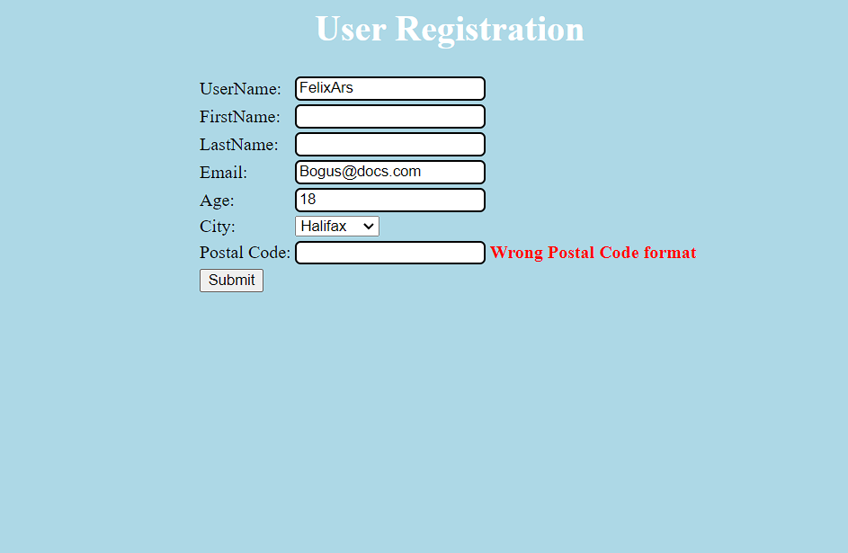

I created test cases for most inputs. I ignored FirstName and LastName because I didn't think they were relevant.
I didn't create test cases for City because that one can never cause an error. I ran all the tests manually and 
updated the following table accordingly.

| Test Case | Expected Results | Actual Results | Verdict (Pass, Fail, Inconclusive) |
|----------|----------|----------|----------|
| TC1. Username: FelixArs, Email: Bogus@docs.com, Age: 18, Postal Code: J9J0M4  | Success/No Errors | Success/No Errors | Pass    |
| TC2. Username: Felix, Email: Bogus@docs.com, Age: 23, Postal Code: J9J0M4    | Err3: Size must be between 6 and 12    | Err3    | Pass    |
| TC3. Username: 5elixArs, Email: Bogus@docs.com, Age: 20, Postal Code: J9J0M4  | Err1: Wrong UserName Format      | Err1      | Pass     |
| TC4. Username: NULL, Email: Bogus@docs.com, Age: 25, Postal Code: J9J0M4  | Err2: UserName is Mandatory | Err1 and Err3 | Inconclusive    |
| TC5. Username: FelixArs, Email: , Age: 64, Postal Code: J9J0M4  | Err7: An email address is mandatory | Err6 | Inconclusive    |
| TC6. Username: FelixArs, Email: Bogus@docscom, Age: 18, Postal Code: J9J0M4  | Err6: Wrong Email Format | Err6 | Pass    |
| TC7. Username: FelixArs, Email: Bogus@docs.com, Age:, Postal Code: J9J0M4  | Err8: Age is mandatory | Err8 | Pass    |
| TC8. Username: FelixArs, Email: Bogus@docs.com, Age: 16, Postal Code: J9J0M4  | Err9: Must be greater or equal to 18 | Err9 | Pass    |
| TC9. Username: FelixArs, Email: Bogus@docs.com, Age: 70, Postal Code: J9J0M4  | Err10: Must be less than or equal to 64 | Err10 | Pass    |
| TC10. Username: FelixArs, Email: Bogus@docs.com, Age: AA, Postal Code: J9J0M4  | Some kind of Error | java.lang.NumberFormatException | Inconclusive    |
| TC11. Username: FelixArs, Email: Bogus@docs.com, Age: 18, Postal Code:   | Err11: Wrong Postal Code format | Err11 | Pass    |

An example of TC11  
