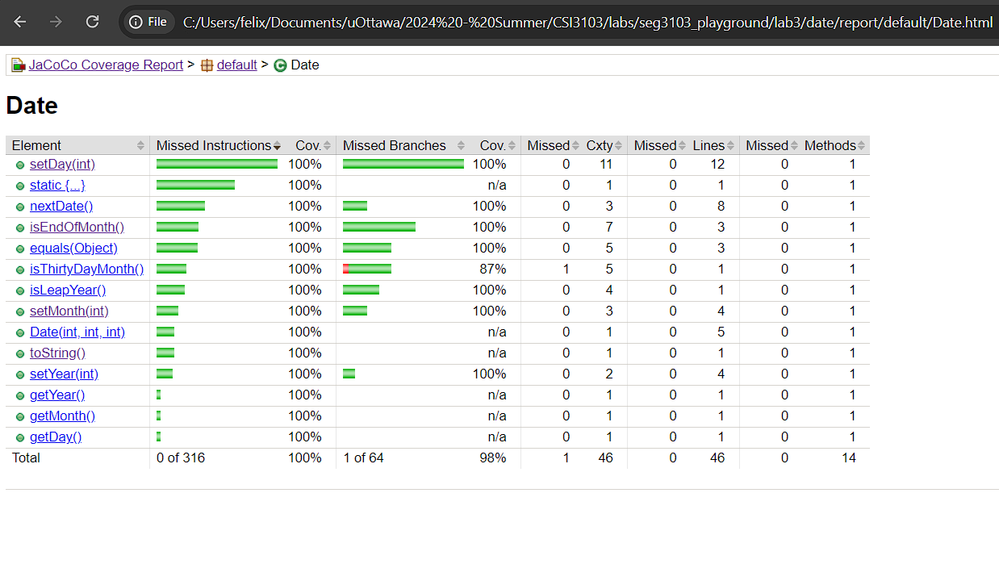

To help me find a solution, I ran jacoco to see where the tests were lacking in coverage.
I focused on methods that didn't have as much coverage as others such as the setDay(int), isEndOfMonth(), equals(Object) and toString().

I added one test to see if toString() works as intended. I added 3 tests for equals(Object): one for the same date, one for different dates and one for different objects.

For setDay(int), I added tests that check if a month has more than 31 days, if a 30 day month has 31 days and if February has more than 29 days on a leap year.

I added some tests for isEndOfMonth() such as if it's the 28th day of February on a non-leap year and the 29th of February on a leap year.

I got the code coverage pretty high with those new tests: 100% on Statement coverage and 95% on branch coverage. I could try to add more tests for 100% branch coverage but they become quite redundant at this point. 

As for refractoring the code, I didn't see much that I could do. I encapsulated the monthName array so that it can't be accessed or modified from the outside. I compacted isLeapYear() into a single return statement. I simplified isEndOfMonth() and isThirthyDayMonth() by removing if-else statements and only having a single return statement.
After doing all those changes, my tests still worked and, in fact, the branch coverage increased to 98%. This is due to the fact that I replaced if-else statments with a single return statement.

